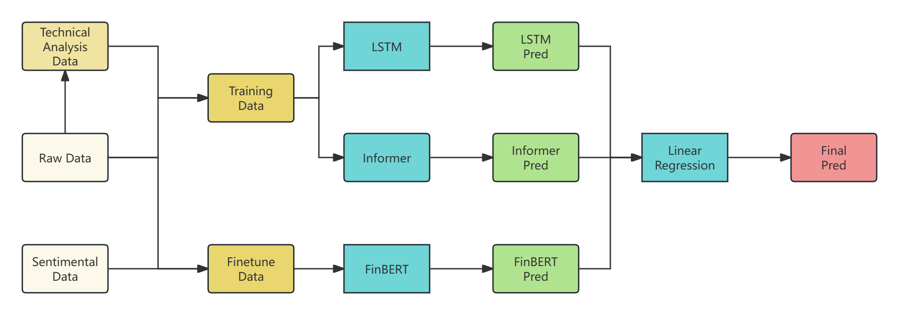
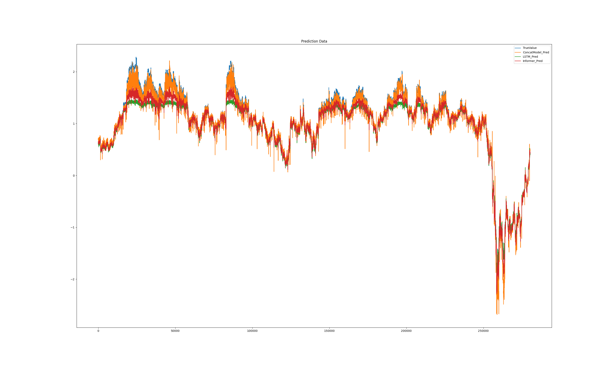
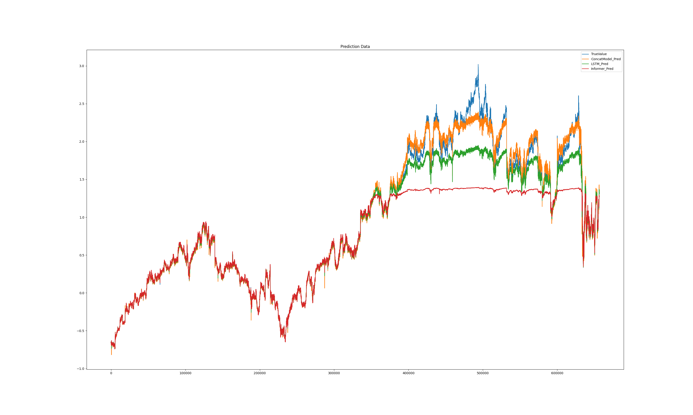
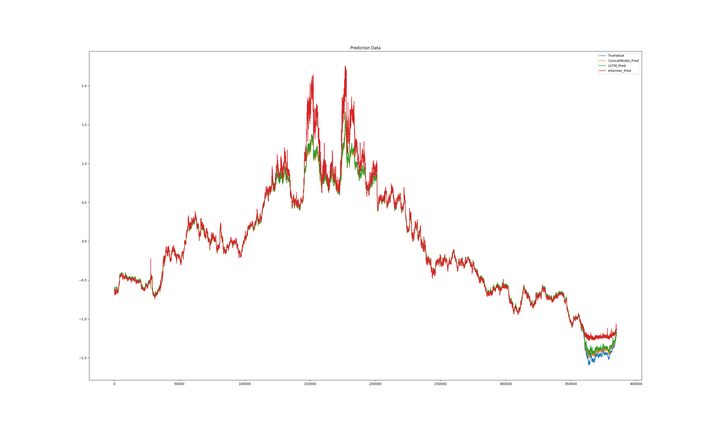
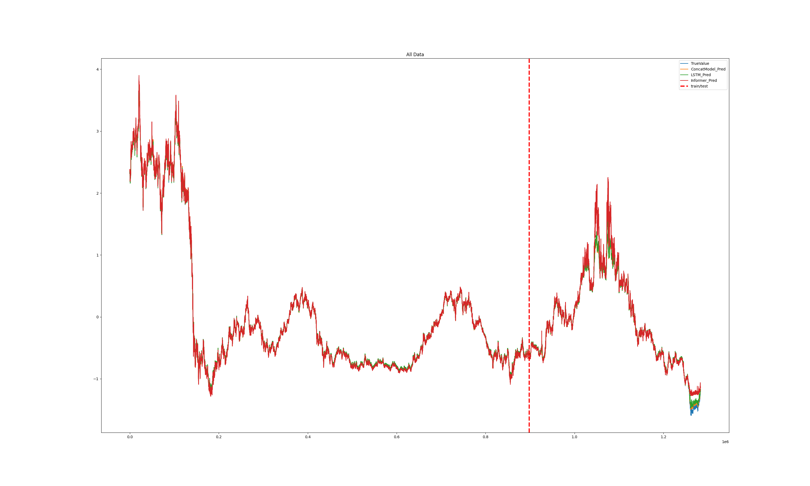

# Concatenate LSTM and Informer together

2024.09.01 Update

This time I join the sentimental data as another method. Not directly concatenating the sentimental analysis data into the dataset as the input of LSTM or Informer, I use raw data and the headlines to finetune FinBERT, and use it to predict the price in four hours later, you can see the structure in Fig 1.



<center>Fig 1 New Model Structure</center>

And we view the results in Table 1, in most of the stocks, LSTM gets the best score, but the other two models also have promotion in the big model. The results of ConcatModel wins every time in the prediction.

| Stock_name | ConcatModel's MSE | LSTM's MSE | Informer's MSE | FinBERT's MSE |
| ---------- | ----------------- | ---------- | -------------- | ------------- |
|AA|0.00011247944745883067|0.00017066089237121804|0.005229426547884941|0.0027253799332048073|
|BAC|2.8650179947455874e-05|3.282435180799371e-05|0.006433886010199785|0.0029133608303388474|
|C|4.023297592954095e-06|4.890533445706939e-06|0.002451034262776375|0.0012557032973476232|
|CSCO|0.0002977840743930921|0.0039098336296025755|0.301190584897995|0.09357463994096031|
|DWDP|0.01679880652065885|0.030678454569339403|0.04663688316941261|0.04092688464901401|
|GM|0.004851504527710932|0.014389968099371165|0.008571750484406948|0.01584191314797937|
|HPQ|0.002115236760888612|0.011858680443275156|0.05211689695715904|0.02969418556645596|
|IBM|8.388794114251633e-06|1.5907944128213826e-05|0.0006578393513336778|0.0017969971380846837|
|INTC|0.003237550748052005|0.0076658489127882775|0.753930389881134|0.21749241796956734|
|JPM|0.032967499942313024|0.04947494484229992|0.09709274023771286|0.070661094920678|

<center>Table 1 Results</center> 

Lets take some examples to see the generalization ability, the following figs are based on the prediction part of the data. In Fig 2, we can see LSTM performs bad to predict several small rises for this stock, but with help of FinBERT and Informer, the final model solves this problem. 



<center>Fig 2 GM's Pred</center>

More often, Informer can not detect big surges like Fig 3, while the ability of FinBERT is good at catching up with big surges, so the ConcatModel solves the problem again. It gets really close to the true values.



<center>Fig 3 HPQ's Pred

---

This time, I spent almost two weeks to rebuild the code as well as enlarge the sentimental analysis dataset. By rebuilding the code, I can easily switch my configuration in order to get the model with better performance. Then the method to concatenate two models seems very simple. I tried neural network, LightGBM and LinearRegression as the model to concatenate two models, then I found the most simple way, LinearRegression, is the best solution.

Then, the whole model structure is like below.


<center>Fig 1 Model Structure</center>

To make the concatenation's usage more visible, I did the experiment on one stock, I will do the test on other stock in this week, and the results are here. We can see that the concatenation can actually lower the MSE. The plot for prediction part only and all data are shown below too. I will do these experiments on all stocks as soon as possible.

Also, I will try to use the pred of LSTM as the feature to train Informer or in reverse.

```
ConcatModel's MSE: 0.00011249626829225636
LSTM's MSE: 0.00017066089237121804
Informer's MSE: 0.005229426547884941
```



<center>Fig 2 Model's Performance on prediction data only</center>



<center>Fig 3 Model's Performance on all data</center>
